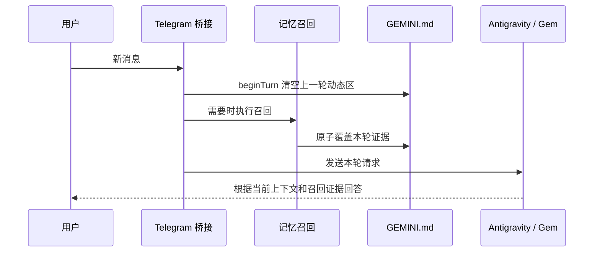

# 阿祈记忆系统

更新时间：2026-07-16

这里保存阿祈新记忆系统的 SQLite、检索程序、动态上下文写入程序、后台整理原型和测试。旧 LMC 不再作为新系统基础，只保留少量机制参考和暂时回滚能力。

这份 README 是当前方案的“冻结快照”，方便恢复会员、重新开始真实聊天后继续验证。它不是最终设计，也不把离线测试写成已经上线。

## 我们最终想要的结果

用户需要回忆时，Gem 能准确找到有关记忆；摘要或 Card 不够时，再查原始聊天，返回贴合问题的时间、事件和原话证据。

同时需要满足：

- 普通聊天不因为后台整理而明显变慢。
- 原始聊天始终保留，Summary、Card 和事实线只是索引与压缩，不替代原文。
- 不要求每轮生成新记忆，也不要求每轮加载整个向量库。
- 旧事实不删除，通过时间线保留变化过程。
- 动态召回内容只覆盖 `GEMINI.md` 的指定区域，不改稳定人格和规则。
- 模型可以自动整理，但程序必须限制来源、时间、引用、写入范围和重复内容。

## 当前结构思维导图

```mermaid
flowchart TD
    A["阿祈记忆系统"] --> B["原始证据层"]
    A --> C["整理记忆层"]
    A --> D["检索与排序层"]
    A --> E["本轮动态上下文"]
    A --> F["真实聊天接入"]

    B --> B1["Telegram 原始聊天 JSON"]
    B --> B2["conversations"]
    B --> B3["raw_messages"]
    B3 --> B4["FTS5 trigram 索引"]
    B3 --> B5["Jieba 词语索引"]
    B3 --> B6["本机 bge-m3 向量"]

    C --> C1["event_summaries：一段对话的压缩"]
    C --> C2["event_occurrences：首次、最近、计数等事件索引"]
    C --> C3["memory_cards：偏好、边界、计划等"]
    C --> C4["memory_sources：Card 与原文的连接"]
    C --> C5["fact_timelines：同一类可变化事实"]
    C --> C6["fact_events：事实线中的每次变化"]
    C --> C7["memory_processing_jobs：待整理任务"]

    D --> D1["日期、名称、原话：词面检索优先"]
    D --> D2["换一种说法：必要时向量兜底"]
    D --> D3["按问题类型选择 Summary、Card、Fact、Event 或原文"]
    D --> D4["候选过滤、证据门槛、字符预算"]

    E --> E1["memory_recall 返回本轮证据"]
    E1 --> E2["memory-context-writer 原子覆盖动态区"]
    E2 --> E3["GEMINI.md 稳定正文保持不变"]
    E2 --> E4["无结果或需澄清时清空旧动态内容"]
    E2 --> E5["较旧并发请求不能覆盖较新请求"]

    F --> F1["SQLite 原始消息增量写入：已接入"]
    F --> F2["memory_recall MCP：已配置并通过协议测试"]
    F --> F3["Antigravity sidecar 主动调用：尚未真实验证"]
    F --> F4["每轮开始清空动态区：尚未接入桥接"]
    F --> F5["Gem 是否读取到刚更新的 GEMINI.md：尚未真实验证"]
```



## 当前真实运行状态

| 部分 | 当前状态 |
|---|---|
| Telegram 新消息增量写入 SQLite | 已启用 |
| FTS5 trigram + Jieba 词语索引 | 已启用 |
| 本机 `bge-m3` 向量兜底 | 程序已启用，按需加载 |
| `memory_recall` MCP | 已配置，协议测试通过 |
| 动态写入 `GEMINI.md` 的程序 | 已补全，可独立测试 |
| 真实 Gem 自主调用召回 | 尚待端到端验证 |
| 每轮开始前清空旧动态区 | 尚未接入 Telegram 桥接 |
| 后台任务入队 | 已接入 |
| 后台 worker 与外部整理模型 | 关闭 |
| 自动生成 Summary / Card / Fact | 暂停 |
| 旧 LMC 默认召回和写入 | 已关闭 |

正式运行数据库是 `memory-schema-v2-complete.sqlite`。它和聊天记录一样只保存在本机，不提交到 Git。

## 数据怎么分层

| 层 | 保存什么 | 主要用途 |
|---|---|---|
| 原始聊天 | 用户与助手的逐条消息 | 最终证据、原话、遗漏内容找回 |
| Event Summary | 一段有共同主题或目的的聊天压缩 | “某天聊了什么”“这件事的过程” |
| Event Occurrence | 可计数、可找首次或最近一次的事件 | “第一次”“最近一次”“一共几次” |
| Memory Card | 相对稳定的偏好、边界、计划等 | 高频个人记忆 |
| Fact Timeline | 同一类会变化的事实主线 | 工作、居住、状态等历史变化 |
| Fact Event | 事实线中某个时间点的状态 | 不删除旧事实，按时间查看 |
| Memory Source | Card 与原文的多对多关系 | 回查证据、重新生成、彻底删除 |
| Processing Job | 尚待后台模型处理的消息批次 | 重试、限频、失败恢复 |

八张业务表和字段说明见 [`SCHEMA_V2_FIELD_GUIDE.md`](./SCHEMA_V2_FIELD_GUIDE.md)。

## 当前召回思路

目前的检索器会先判断用户要的答案形态，例如日期概览、事件过程、原话、首次、最近一次、计数、偏好清单或事实。之后再选择合适的数据层：

1. 有明确日期、名称、短语时，优先查 SQLite 的 FTS5 和 Jieba 索引。
2. 词面找不到、但可能只是换了说法时，再使用 `bge-m3` 向量。
3. Summary、Card 或事实线能直接回答时，优先返回压缩结果。
4. 用户要求原话、细节或上层记忆证据不足时，再返回少量原始聊天。
5. 所有候选都要经过相关性和证据门槛，并受本轮字符预算限制。

这一套目前能做实验，但**召回触发和问题分类仍没有定稿**。接下来需要真实比较三种方向：

| 方向 | 做法 | 主要代价 |
|---|---|---|
| 当前意图路由 | 先判断问题类型，再调用对应检索流程 | 规则容易越补越多 |
| 广泛廉价检索 | 除寒暄外先快速查索引，再严格控制注入 | 每轮多一点固定查询成本 |
| 小模型规划 | 让小模型决定是否查、查哪层、查多少 | 多一次模型延迟，也可能判断错误 |

现在不急着凭感觉选定。会员恢复后，应该用同一批真实问题比较命中率、误召回、漏召回和时间，再决定最终路线。

## 动态写入 `GEMINI.md`

动态写入程序在 [`memory-context-writer.cjs`](./memory-context-writer.cjs)，召回服务在 [`memory-recall-service.cjs`](./memory-recall-service.cjs) 中使用它。

它只管理以下区域：

```md
<!-- MEMORY_CONTEXT_START -->
本轮召回结果
<!-- MEMORY_CONTEXT_END -->
```

当前已经具备的保护：

- 每次写入都完整覆盖旧动态区，不累计旧轮次内容。
- 没找到结果或问题需要澄清时，清空旧内容，但保留空标记。
- 先写临时文件，再替换目标文件，避免只写了一半。
- 同一 session 中，较早开始但较晚结束的召回不能覆盖较新的召回。
- 动态块缺少标记、标记重复或顺序错误时拒绝写入。
- `GEMINI.md` 标记之外的人格、规则和其他稳定内容保持原样。

未来接入桥接时，正确顺序应当是：



现在只完成了写入器和召回服务内部接线。`beginTurn` 还没有接到 Telegram 每条新消息前，Antigravity sidecar 是否会读取刚修改的文件也没有经过真实聊天验证。

## 当前优势

- 原始聊天不会因为摘要质量不好而丢失。
- SQLite 适合按日期、人物、来源和关系精确查询。
- 词面检索便宜；只有必要时才加载向量模型。
- Summary、Card、事实线与原文可以互相连接，不必把全部历史塞进提示词。
- 事实变化可以追加时间线，不需要直接覆盖旧事实。
- 后台整理关闭时不会影响正常聊天，也不会产生额外模型费用。
- schema、字段和迁移已有基础，后续增加字段或索引不需要推翻整个数据库。

## 当前劣势和风险

这些问题目前都是真实存在的：

1. **尚未接入真实回复链路。** MCP 配置和离线测试通过，不代表 Antigravity 已经会调用它。
2. **离线测试不等于回答正确。** 测试主要证明程序没有坏、路由能运行，不足以证明召回内容就是用户真正想要的答案。
3. **当前路由有补丁化倾向。** 每发现一种问法就增加规则，长期会难维护，也可能互相冲突。
4. **摘要和 Card 样本仍不完整。** 后台模型关闭后，新聊天只会进入原文和任务队列，不会自动形成高质量上层记忆。
5. **向量检索存在延迟。** 本机首次加载 `bge-m3` 较慢，也会占用内存；数据增长后不能每次扫描全部原文向量。
6. **缺少正式 reranker。** 当前主要依靠检索分数、规则和证据门槛，语义相近但不是同一事件时仍可能选错。
7. **中文时间表达仍容易出错。** “上个月的今天”“前几天”“那阵子”需要统一转换为上海时区的明确范围。
8. **事件计数依赖事件切分。** 如果同一事件被切成多段，或者多次事件被合并，首次、最近和计数都会不准。
9. **动态文件读取时机未验证。** 如果 sidecar 只在启动时读取 `GEMINI.md`，写入器虽然成功，当前请求也可能看不到新内容。
10. **旧动态内容必须每轮清理。** 如果桥接没有在新消息开始时调用 `beginTurn`，不需要召回的下一轮仍可能看到上一轮证据。
11. **外部笔记和历史文本仍是不可信数据。** 这里的“不可信”不是说内容没用，而是说它们只能作为资料，不能执行指令、覆盖系统规则或证明旧助手真的完成了某项操作。
12. **隐私与删除流程尚未完全实现。** 数据主要在本机，但按 session 限制读取、导出、彻底删除和审计还需要后续补齐。

## 启动和性能原则

- 启动时只打开 SQLite 和小型索引，不读取全部聊天。
- 不在每轮启动时重新下载模型；`bge-m3` 只需下载一次。
- 词面检索优先，向量只在词面不足时使用，并保持一段时间常驻。
- 原始聊天越来越多后，应先用日期、人物、来源或 FTS 缩小候选，再做向量比较。
- 后台 Summary / Card / Fact 整理按批次运行，不阻塞 Telegram 回复。
- 每轮只注入回答所需的少量证据，不把召回候选全部写进 `GEMINI.md`。

## 恢复真实聊天后先做什么

1. 把 `beginTurn` 接到 Telegram 每条用户消息进入 sidecar 之前。
2. 确认 Antigravity 在本轮请求中确实读取到刚更新的 `GEMINI.md`。
3. 用 30～50 个自然问题做真实回放，记录：是否触发、查到什么、用了多久、最终回答是否正确。
4. 专门测试日期概览、项目过程、原话、首次、最近、计数、偏好和模糊指代。
5. 对比“当前路由”和“广泛廉价检索”，不要再根据单个失败问题逐条打补丁。
6. 确认召回路线后，再恢复 Summary / Card / Fact 的后台模型生产。
7. 新链路稳定观察一段时间后，再备份并清理旧 LMC。

## 文档入口

| 文档 | 用途 |
|---|---|
| [`MEMORY_RUNTIME_V1.md`](./MEMORY_RUNTIME_V1.md) | 当前运行流程与开关 |
| [`UNIFIED_RECALL_SPEC.md`](./UNIFIED_RECALL_SPEC.md) | 各类问题取哪层证据 |
| [`SCHEMA_V2_FIELD_GUIDE.md`](./SCHEMA_V2_FIELD_GUIDE.md) | 八张业务表、任务表和派生索引 |
| [`MEMORY_CONTENT_RULES_V1.md`](./MEMORY_CONTENT_RULES_V1.md) | Summary 与 Card 写什么、不写什么 |
| [`MEMORY_PRODUCER_V1.md`](./MEMORY_PRODUCER_V1.md) | 后台批次、证据验收、重试和幂等写入 |
| [`FACT_UPDATE_SPEC_V1.md`](./FACT_UPDATE_SPEC_V1.md) | 不删除旧事实的时间线更新规则 |
| [`memory-v1-migrations/README.md`](./memory-v1-migrations/README.md) | SQLite schema 与索引升级方法 |

`memory-system-config.json` 是当前开关、批次和阈值的统一配置来源。

## 常用验证

从仓库根目录运行：

```powershell
node .\tests\memory-system.test.cjs
node .\bridge-workspace\memory-pipeline-lab\validate-memory-schema-v2.cjs
node .\bridge-workspace\memory-pipeline-lab\run-memory-recall-mcp-tests.cjs
node .\bridge-workspace\memory-pipeline-lab\run-memory-producer-offline-lab.cjs
```

历史 HTML、JSON、测试 SQLite 和通过数量只用于回归或人工对比，不代表真实聊天中的最终召回质量。
