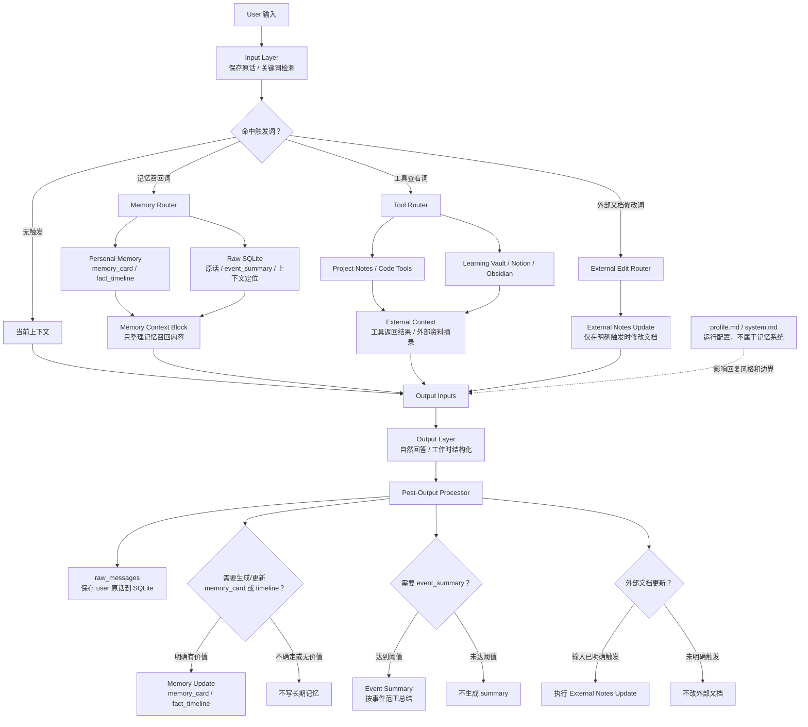
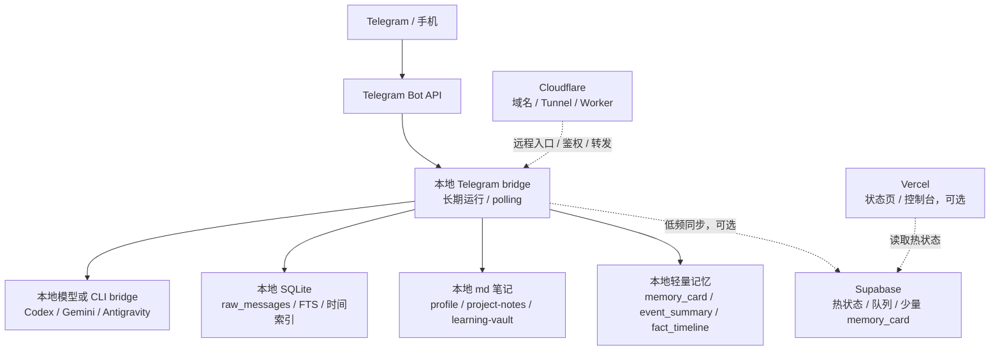

# 阿祈记忆系统计划稿

> 记录时间：2026-07-06 / 2026-07-07  
> 文档性质：历史需求与讨论草稿，含早期模型协助整理的方案，不是当前运行说明。
>
> 当前实现请看 `MEMORY_SYSTEM_OVERVIEW.md` 和 `bridge-workspace/memory-pipeline-lab/MEMORY_RUNTIME_V1.md`。
>
> 本文保留是为了追溯咱们真正想要的结果；其中旧表结构、平台分工、待确认项和实施顺序不应直接当作现状。
> 背景：不直接扩展现有 LMC。新系统保留 LMC-5 的 raw events、curated memory、事实演变、召回 trace 等启发，但整体方案收束为更轻量的“记忆路由器 + 外部笔记 + 个人记忆 + 原始对话库”。

## 1. 当前结论

我们不做一个包办所有事情的超级记忆库。当前方向是：

```text
Aqi Memory Router
负责判断去哪查、怎么组装上下文。

profile.md / system.md
保存稳定偏好、边界、人格和输出方式。
它是运行配置，不属于记忆系统本体。

external notes
保存项目、代码、学习资料等变化快或体量大的内容。

personal memory
保存 self、health、finance、relationships 等长期个人状态。

raw conversation store
本地 SQLite 保存用户原话和对话记录，用时间、会话位置、全文搜索检索。
```

一句话：

```text
稳定偏好写进 profile；变化快的放外部笔记；个人长期状态用轻量记忆卡；可变事实用时间线；原话进 SQLite 做证据。
```

## 2. 总体结构图



## 3. 各部分职责

### 3.1 profile.md / system.md

用于保存稳定、长期、会影响模型行为的内容。它是运行配置，不属于记忆系统的一部分。

适合写入：

```text
用户偏好中文沟通。
用户不希望我擅自 clone 仓库或改系统设置。
日常聊天要自然，不必每次展示来源。
工作/项目讨论可以更结构化。
健康、财务、关系类回答要以用户输入为主，不做过度推断。
```

这些内容可以由用户手动修改，也可以在用户明确要求时让模型修改。

### 3.2 external notes

变化快、资料量大、需要工具实时确认的内容放外部。

项目/代码类：

```text
project-notes/<project>/overview.md
project-notes/<project>/decisions.md
project-notes/<project>/tasks.md
project-notes/<project>/file-map.md
project-notes/<project>/log.md
```

学习类：

```text
learning-vault/<topic>/notes.md
learning-vault/<topic>/reading.md
learning-vault/<topic>/progress.md
```

原则：

```text
项目细节不塞进通用长期记忆。
代码事实以仓库/工具实时查看为准。
学习资料原文放外部资料库。
通用记忆只记入口、大方向和长期偏好。
外部文档修改必须由明确关键词/指令触发，不能每轮自动修改。
```

### 3.3 personal memory

用于 self、health、finance、relationships 等长期个人状态。这里使用轻量 `memory_card`。

适合写入：

```text
用户明确表达的长期偏好。
用户确认的健康、财务、关系状态。
用户与模型的互动边界和沟通方式。
持续性的计划、目标、习惯、趋势。
```

不适合写入：

```text
模型自行诊断。
模型过度心理推断。
一次性闲聊。
未经用户确认的敏感判断。
```

### 3.4 raw conversation store

保存用户原话和上下文定位，不等于当前事实。

用于回答：

```text
我是不是说过 xxx？
我原话怎么说的？
哪天提到过？
你记得我之前说过的 xxx 吗？
```

原则：

```text
原话是证据，不自动变成 current fact。
第一版不做原话去重/聚类。
需要上下文时，通过时间锚点、conversation_id、message_index 回查前后内容。
```

## 4. 输入、处理、输出、更新

整个系统按四段理解：

```text
Input
用户原始输入、保存原话、关键词触发召回或工具调用。

Processing
参考当前上下文、Memory Context、External Context，生成回答所需上下文。

Output
自然回答。日常不刻意展示来源；工作场景可以更明确；不确定就说明。

Post-Output
回复后处理：保存原话；必要时写 memory_card / fact_timeline；达到阈值才生成 event_summary；明确触发才修改外部文档。
```

## 5. 召回与工具触发策略

第一版采用关键词触发，不让模型每轮自行判断是否召回。

```text
无关键词触发 -> 不查长期记忆
有关键词触发 -> 按关键词类别粗路由，再提取具体 topic/time/domain
```

关键词分两层：

```text
第一层：全局触发关键词库
只判断要不要启动召回/工具流程。

第二层：关键词类别路由
判断大概要查 raw SQLite、personal memory、external notes，还是要修改外部文档。
```

第一层全局触发方向：

```text
之前、以前、上次、那天、昨天、最近
你记得、我说过、我们聊过、原话
下一步、计划、待办、继续、还没做
那个项目、那个系统、这个文件、那个人
现在还是、有没有变、为什么改
写进、更新、记录、整理
```

第二层类别路由：

```text
原话查找类
你记得我说过、我是不是说过、原话、当时怎么说
-> raw SQLite

时间回顾类
昨天、上次、那天、某天、几号、最近
-> event_summary / raw SQLite

计划任务类
下一步、计划、待办、继续、还没做
-> personal memory / project notes

外部文档修改类
写进、更新、记录到、加入 tasks、写到笔记
-> External Edit Router

项目/代码类
仓库、文件、代码、commit、GitHub、部署
-> Tool Router / project notes

学习资料类
笔记、阅读、课程、复习、资料
-> Learning Vault / external notes
```

具体 topic/domain 不给每个 topic 维护一套关键词，而是从用户文本和当前上下文提取。

第一版避免过度复杂：

```text
不要每轮全局深搜。
不要复杂多跳图检索。
不要把 domain/topic 判断当硬门。
结果不确定时说不确定。
自动读取可以多一点，自动写入必须少一点。
```

## 6. Context Block、External Context 与动态注入

参考 Zep 的 context block 思路：召回后不要把零散记忆结果直接塞给模型，而是整理成回答需要的小包。

但外部工具查看结果不一定进入 Memory Context Block。

```text
Memory Context Block
只整理 Personal Memory 和 Raw SQLite/event_summary 召回内容。

External Context
Project Notes、Code Tools、Learning Vault、Notion、Obsidian 等工具返回内容。

Output Inputs
当前上下文 + Memory Context Block + External Context。
```

可以把本轮召回到的记忆写入 `codex.md` / `gemini.md` 的动态区域：

```md
<!-- Aqi Memory Context: start -->
本轮召回的记忆上下文...
<!-- Aqi Memory Context: end -->
```

这个动态区域不是长期存储，下次召回时覆盖。

Memory Context Block 可以包含：

```text
current facts       当前有效事实
active plans        当前计划/待办
recent events       最近相关事件摘要
raw evidence        必要时的用户原话证据
warnings            旧事实/原话证据/推测不能当 current fact
```

日常聊天时 Memory Context Block 应该尽量轻；工作问题可以更完整。

## 7. memory_card 类型与字段

### 7.1 记忆类型

当前采用更自然的记忆类型：

```text
stable
稳定事实、偏好、边界、长期状态。

episode
发生过的事、一段经历、一段讨论、事件摘要。

plan
计划、待办、下一步、进行中事项。

pattern
反复出现的模式、倾向、趋势。

tracker
周期记录，例如读书、学习、运动、健康习惯、复习、每周计划。
```

`raw` 原话不算 memory_card 类型，单独放 SQLite。

### 7.2 基础信息

所有 memory_card 都有基础信息：

```text
记忆编号
记忆类型
标题
内容
所属大类
所属主题
当前状态
关键词
来源
来源身份
创建时间
更新时间
去重标识
```

说明：

```text
暂时不保留数字 confidence。
如果不确定，用状态 needs_review 或来源身份 assistant_inferred 表达。
```

来源身份第一版先用：

```text
user_explicit       用户明确说
user_confirmed      用户明确确认/决定
assistant_inferred  模型推测/总结
external_source     外部文档/工具来源
system_observed     系统观察/操作日志
```

示例：

```text
标题：召回采用关键词触发
内容：用户决定第一版采用关键词触发召回，而不是每轮让模型自行判断。
所属大类：projects
所属主题：阿祈记忆系统
记忆类型：stable
当前状态：current
关键词：召回、关键词触发、检索
来源：用户原话 2026-07-07
来源身份：user_confirmed
```

### 7.3 类型专属信息

不同记忆类型可以附加专属信息。具体字段后续按类型细化。

```text
stable
可选：事实线编号、是否当前事实、有效开始时间、对应时间线。

plan
可选：截止时间、优先级、是否完成、完成时间、阻塞原因。

episode
可选：时间范围、来源消息范围、关键决定、未决问题、重要程度、是否已被长期记忆吸收。

pattern
可选：观察周期、出现次数、最近出现时间、相关证据。

tracker
可选：周期、记录项、周期开始/结束、回顾、下一周期计划。
```

临时事件：

```text
临时事件不使用“检查时间”作为通用字段。
临时事件是否需要提醒/确认，由后续规则或事件类型决定。
周期性事件（例如经期）比较特殊，不按普通 temporary_event 处理，需要单独规划。
```

### 7.4 不属于 memory_card 的内容

用户原话不放进 memory_card，单独进入 Raw Conversation Store。

```text
raw_messages
保存原话、时间、会话编号、消息位置、主题提示。
```

第一版不做 `utterance_clusters`。因为 raw 对话全量保存在 SQLite，有 FTS 和时间索引，先直接搜索即可。以后如果发现同义重复太多，再考虑做聚类视图。

fact_timeline 也单独存在，通过事实线编号与 memory_card 连接。

## 8. fact_timeline：事实演变

可变事实不用 `supersedes / superseded_by` 互相指来指去，改用时间线。

原则：

```text
时间线按发生顺序保存：最早 -> 最新。
只有 current 需要明确标注。
历史信息只按时间呈现，不需要 old/discarded/considered 一堆状态。
current_event_id 指向当前有效版本。
fact_key 只给会变化、需要时间线追踪的关键事实用，不是每条记忆都有。
```

fact_key 作用：

```text
把同一条会变化的事实线串起来。
例如 memory.retrieval.trigger_policy 表示“记忆系统的召回触发策略”。
```

示例：

```json
{
  "fact_key": "memory.retrieval.trigger_policy",
  "topic": "阿祈记忆系统",
  "current_event_id": "evt_keyword_trigger",
  "events": [
    {
      "id": "evt_model_judge",
      "time": "2026-07-07T10:00:00",
      "content": "讨论过让模型自行判断是否召回。",
      "source_refs": ["raw_message_001"]
    },
    {
      "id": "evt_keyword_trigger",
      "time": "2026-07-07T11:00:00",
      "content": "决定第一版采用关键词触发召回。",
      "source_refs": ["raw_message_002"]
    }
  ]
}
```

检索/回答：

```text
问“现在是什么？” -> 读 current_event_id 指向的事件。
问“怎么变成这样的？” -> 按时间正序讲 timeline。
问“最近变化？” -> 倒序看最近事件。
```

## 9. event_summary

event summary 不是长期事实，而是把一段原始对话/一组事件压成“发生了什么”。

作用：

```text
帮助回答“那段对话大概发生了什么”。
帮助快速定位上下文。
帮助后续生成 memory_card。
不替代用户原话。
不替代 current fact。
```

第一版不每轮生成 event_summary。达到阈值才生成。

触发阈值：

```text
会话结束。
topic 明显切换。
同一 topic 累积到足够多有效消息，例如 20 条消息或 4000 字左右。
用户明确要求“总结一下 / 记录一下 / 整理一下”。
```

出现明确决定/计划/结论时，可以先标记本段有重要事件，但不一定立刻生成 summary；等会话结束、topic 切换或消息量达到阈值时一起总结。

示例：

```json
{
  "id": "event_summary_20260707_memory_design",
  "time_range": {
    "start": "2026-07-07T10:00:00",
    "end": "2026-07-07T12:00:00"
  },
  "topic": "阿祈记忆系统",
  "summary": "讨论了召回触发、项目记忆外部化、时间线式事实更新、原话证据和 event summary 的作用。",
  "key_decisions": [
    "第一版召回采用关键词触发。",
    "可变事实用时间线，current_event_id 标当前有效版本。",
    "项目/代码类记忆外部化。"
  ],
  "open_questions": [
    "关键词触发列表待确认。",
    "周期性事件需要单独规划。"
  ],
  "source_message_range": {
    "conversation_id": "conv_20260707",
    "start_index": 100,
    "end_index": 180
  }
}
```

定期审计：

```text
event_summary 不能只写不管。
需要定期检查哪些 summary 太碎、重复、已被 memory_card 吸收、可以归档。
被吸收的 summary 默认不召回，只在用户问历史过程或原话上下文时使用。
系统可以提出归档/删除建议，最终删除需要用户确认。
临时短期事件不参与普通 event_summary 审计。
```

## 10. Raw Conversation Store：SQLite 与索引

原始对话底层放本地 SQLite，而不是一个大文档。

原因：

```text
按时间查很快。
按 conversation_id + message_index 拉前后文很快。
SQLite FTS5 可以做全文搜索。
本地文件易备份和迁移。
不依赖外部服务。
```

最小表结构：

```text
raw_messages
- id
- conversation_id
- message_index
- speaker
- text
- timestamp
- topic_hint
- text_hash
- created_at
```

第一版索引：

```text
timestamp 索引
conversation_id + message_index 联合索引
topic_hint 索引
FTS5 全文搜索索引
```

常用查询：

```text
按日期查：timestamp between 某天开始 and 某天结束。
按关键词查：FTS 搜 text。
拉上下文：conversation_id = xxx 且 message_index between N-5 and N+5。
按时间锚点回查：以 memory_card.event_time 为中心查前后 10 分钟，不够再扩大。
```

关于容量：

```text
10 万条消息很轻松。
100 万条消息在索引设计正常时也可以接受。
真正变慢通常是没有索引、一次查太大范围、FTS 不维护、或者一次给模型太多结果。
```

当前阶段：

```text
暂时不需要特别处理过去对话。
先保证新写入的 raw_messages 有正确索引。
不做 raw 原话去重，不做 utterance_clusters。
后续如果数据量变大，再做冷热归档。
```

后续可选归档策略：

```text
最近 3-6 个月留在 hot raw store。
更早的原始对话按月份归档成 archive_YYYY_MM.sqlite 或 JSONL 压缩备份。
event_summary / memory_card / fact_timeline 长期保留。
定期执行 FTS optimize / vacuum。
```

## 11. 外部化策略

### 11.1 项目/代码

项目类记忆特殊，变化快，单独外部化。

```text
通用记忆只保存项目入口和长期协作偏好。
项目细节写 project notes。
代码事实以仓库实时查看为准。
需要项目记忆时，Router 调用工具读取外部文件和代码。
```

### 11.2 学习

学习资料也适合外部库。

```text
通用记忆保存学习目标、阶段、偏好、进度入口。
学习资料原文、阅读笔记、课程内容放 learning vault / Notion / Obsidian。
```

### 11.3 健康 / 财务 / 关系 / self

这些放 personal memory，但要谨慎：

```text
健康、财务以用户输入为主，不做模型诊断。
用户和其他人的关系以用户明确写入为主，模型推测只作低置信观察。
用户和模型的关系可以记录互动偏好、边界和踩雷点。
self 是长期稳定偏好的核心来源，但非常稳定的内容应进入 profile.md。
经期等周期性健康事件需要单独设计，不直接套普通 temporary_event。
```

### 11.4 周期记录

一般周期记录先作为 `tracker` 处理。

适用：

```text
读书
学习
运动
健康习惯
复习
每周计划
```

月经等健康周期事件更特殊，暂时不纳入第一版规则，后续单独设计。

## 12. 第一版 MVP

第一版只做这些：

```text
1. profile.md / system.md 作为稳定偏好入口，但不算记忆系统本体。
2. Project Notes / Learning Vault 外部化。
3. Personal memory cards：基础信息 + 类型专属信息。
4. Memory type：stable / episode / plan / pattern / tracker。
5. fact_timeline：按时间正序 + current_event_id。
6. Raw Conversation Store：本地 SQLite + 时间/会话/FTS 索引。
7. event_summary：达到阈值才生成。
8. 关键词触发召回和工具调用。
9. Memory Context Block：只整理记忆系统召回内容。
10. External Context：工具返回内容单独提供。
11. 动态上下文可写入 codex.md / gemini.md 的专门区域。
12. 基础 UI/管理：删除、归档、改 topic/domain、标记错误。
13. 基础审计：temporary_event 过期、event_summary 归档、needs_review backlog。
```

暂时不做：

```text
完整 E 轴。
数字 confidence。
复杂 MemoryCandidate 审核池。
全局大知识图谱。
复杂多跳推理。
自动人格分析。
每轮模型判断是否召回。
自动重写大型 snapshot。
项目文件关系长期死记。
周期性健康事件的完整规则。
旧对话冷热归档。
utterance_clusters / 原话聚类。
```

## 13. 已确认设计决策

```text
1. 新系统不直接扩展现有 LMC。
2. 第一版采用关键词触发召回。
3. 关键词采用“全局触发库 + 类别路由”，不为每个 topic 维护独立关键词库。
4. 项目/代码类记忆外部化，通过工具读取 project notes 和代码。
5. 学习资料外部化，通用记忆只记目标和进度入口。
6. Profile Memory 写进 system.md/profile.md，不算记忆系统本体。
7. Personal Memory 使用 memory_card，但分成基础信息和类型专属信息。
8. 记忆类型采用 stable / episode / plan / pattern / tracker。
9. 暂时不保留数字 confidence，用来源身份和 needs_review 表达不确定。
10. 可变事实用 fact_timeline，不用 supersedes/superseded_by 主导。
11. fact_key 只用于需要时间线追踪的关键事实。
12. 时间线底层按时间正序保存，current_event_id 标当前版本。
13. 历史信息用时间线表达，不需要给历史贴太多状态。
14. 原话证据不等于 current fact。
15. 原始对话放本地 SQLite，使用时间、会话位置和 FTS 索引。
16. 第一版不做原话去重/聚类。
17. 回查上下文优先使用时间锚点、conversation_id、message_index。
18. Event summary 用于定位一段对话，不替代长期事实，也不每轮生成。
19. 外部文档修改必须明确触发，不让模型自动乱改。
20. 日常回答自然，不必每次刻意展示来源；工作场景可以更明确。
21. 健康、财务、关系记忆以用户输入为主，模型推测必须有边界。
22. 周期记录先作为 tracker；经期等特殊健康周期事件后续单独规划。
```

## 14. 后续待确认

```text
1. 固定 domain 的最终名字。
2. 关键词触发列表的最终版本。
3. 各 memory type 的专属信息最终字段。
4. 来源身份枚举是否需要继续细分。
5. fact_key 如何生成，中文/英文命名规则。
6. event_summary 生成粒度：按会话、按 topic 切换，还是按消息数量。
7. event_summary 审计和归档规则。
8. raw_messages 的保留期限和归档规则。
9. SQLite schema 和 FTS5 分词方案。
10. Raw Conversation Store 后续冷热归档规则。
11. Project Notes 和 Learning Vault 的实际目录结构。
12. Memory Context Block 的具体格式。
13. External Context 与 Memory Context 的组合规则。
14. codex.md / gemini.md 动态区域的写入和清理规则。
15. UI 第一版具体做哪些管理能力。
16. 周期健康事件，例如经期记录，如何单独建模。
```

## 15. 平台协作参考草案

> 状态：仅作为 2026-07-07 的参考草案。用户仍在考虑，后续需要在主设备上和 Codex 再确认具体方案。这里不作为最终架构决定。

当前前提：

```text
用户不想花钱。
本地 bot 基本长期保持开启。
后续可能直接删除现有 LMC 系统。
当前重点不是把系统全搬云端，而是减少云端额度消耗、降低同步频次、明确平台职责。
```

### 15.1 三个平台的建议职责

```text
本地电脑 / 本地后端
作为主脑：运行 Telegram bridge、模型/CLI bridge、SQLite、md 笔记、记忆整理、项目/学习资料检索。

Cloudflare
作为门和通道：域名、DNS、Tunnel、Worker 轻量转发、简单鉴权、必要时提供远程访问入口。

Supabase
作为可选热状态层：只放当前状态、少量热记忆、同步队列、最近计划或控制状态。不放全量原始对话，不承担重型记忆系统。

Vercel
作为可选网页壳：只放状态页、控制台或轻量 API。不跑重型记忆整理，不作为主要数据库层。
```

一句话版本：

```text
本地做大脑；Cloudflare 做门；Supabase 做小便签；Vercel 暂时不要当核心。
```

### 15.2 推荐优先级

```text
第一优先：本地
全量原始对话、SQLite FTS、memory cards、event summaries、project notes、learning vault、模型桥。

第二优先：Cloudflare
域名、Tunnel、Worker 轻量入口、远程访问本地控制台或公开 API。

第三优先：Supabase
只保留少量热状态和同步队列，避免高频读写和大量存储。

第四优先：Vercel
能不用就不用；如果保留，只做静态控制台/状态页/轻量接口。
```

### 15.3 暂定架构图



### 15.4 云端只放热数据

如果保留 Supabase / Vercel，第一版尽量只同步这些：

```text
当前 bot 状态。
最近活跃会话的简略状态。
当前计划 / active ledger。
少量非常重要的 memory_card。
待本地处理的任务队列。
多端 UI 需要展示的少量状态。
```

不要同步这些：

```text
全量原始对话。
大段历史上下文。
大量 event_summary。
项目文件图谱。
学习资料原文。
向量索引。
每轮自动记忆分析结果。
```

### 15.5 频次原则

```text
本地 raw log 可以高频写。
云端同步必须低频、批量、可关闭。
记忆召回第一版采用关键词触发，不每轮召回。
长期记忆写入不每轮触发，只在明确有价值、达到阈值或用户明确要求时写。
外部文档修改必须由明确关键词/指令触发。
```

可参考的同步节奏：

```text
每轮：只写本地 raw log。
触发关键词：本地检索 memory / raw / external notes。
空闲或积累到阈值：本地生成 event_summary / memory_card。
低频：把少量热状态同步到 Supabase。
需要远程访问：通过 Cloudflare Tunnel / Worker 进入本地服务。
```

### 15.6 完全不用 Supabase / Vercel 的影响

如果完全不用 Supabase / Vercel，仍然可用：

```text
本地 Telegram polling。
本地模型/CLI bridge。
本地 SQLite。
本地记忆系统。
本地 md 项目和学习资料。
```

会变弱：

```text
电脑关机后 bot 不可用。
多端同步变弱。
远程状态页/控制台变弱。
公开 webhook/API 不方便。
云端热记忆不可用。
```

因为用户目前本地 bot 长期开着，所以完全云端化不是第一优先。更合理的是先保留本地核心，谨慎保留少量云端热同步。

### 15.7 后续需要主设备确认的问题

```text
1. 是否继续保留 Vercel，还是只保留 Cloudflare + 本地。
2. Supabase 是否只做热状态/队列，还是彻底停用。
3. Cloudflare Tunnel 是否作为远程访问主入口。
4. Telegram 是否继续使用 polling，而不是 webhook。
5. 本地 SQLite 和 md 文件的实际目录放在哪里。
6. 云端同步的最低频率和最大数据量。
7. 删除 LMC 后，旧 shared-memory / cloud-memory / status-sync 文件是否归档或清理。
8. 是否需要 Tailscale 这类私有网络方案作为远程访问备选。
```
