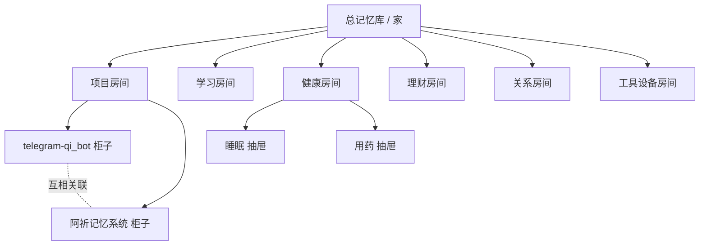
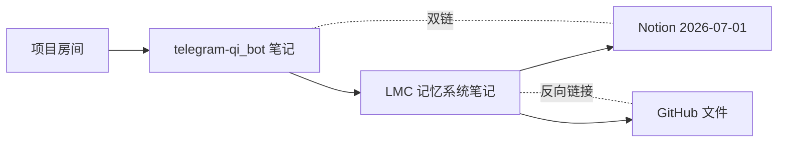
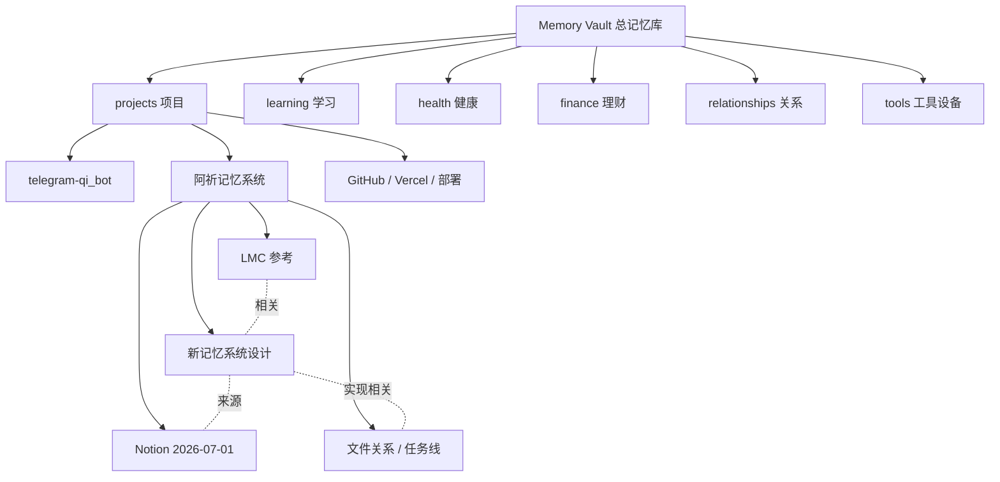
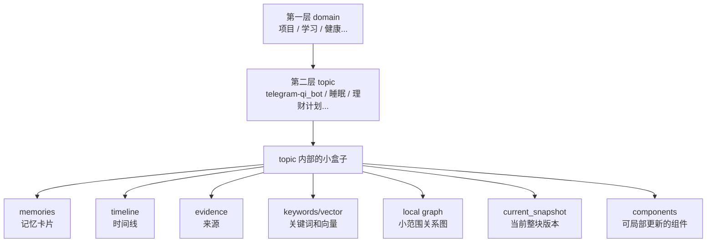
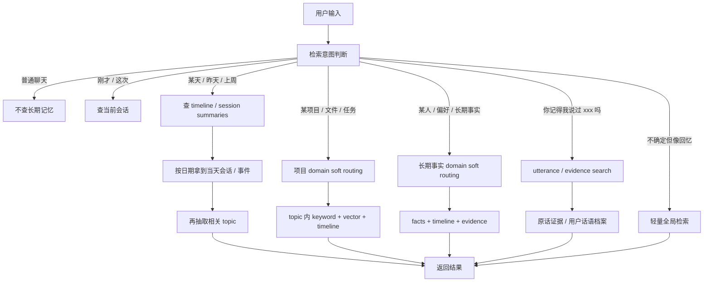
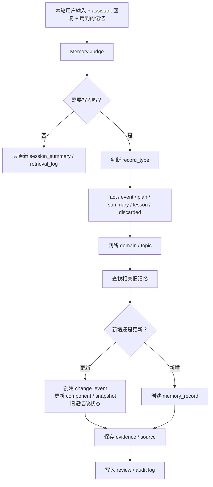

# 阿祈记忆系统初稿

> 记录时间：2026-07-06 / 2026-07-07  
> 状态：初稿，后续继续细化  
> 背景：新系统不打算直接扩展现有 LMC，但会参考 LMC 的分层、时间线、来源证据和召回方式。

## 1. 核心方向

我们要做的不是普通聊天摘要工具，而是一个长期可维护、可检索、可解释、可纠错的记忆系统。

核心形态：

```text
Obsidian 式人类视图
+ 第一层 domain 软路由
+ 第二层 topic / scope 图
+ topic 内部混合检索
+ 时间线与来源证据
+ 当前快照与变更记录
+ 原话证据检索
+ 全局兜底
```

第一层分类不是硬墙，而是检索入口。系统优先去最可能相关的 domain / topic 查找；如果找不到，要能扩大范围，最后全局检索。

## 2. 生活类比

可以把整个记忆库想成一间屋子：



对应关系：

```text
总记忆库 = 家
第一层 domain = 房间
第二层 topic = 柜子 / 抽屉 / Obsidian 页面
memory = 抽屉里的卡片
keyword / vector = 抽屉里的搜索器
timeline = 时间账本
evidence = 来源小票
local graph = 柜子里物品之间的连线
global fallback = 找不到时翻整间屋子
```

Obsidian 更像给人看的笔记墙：



Obsidian 层适合人类整理、删除、改分类、看双链和时间线；机器内部仍然要有结构化字段和索引。

## 3. 分层结构

第一层建议保持 6-7 个大类，用于软路由：

```text
self             稳定偏好、表达习惯、边界、长期目标
projects         项目、代码、仓库、任务、文件关系
learning         学习计划、知识体系、阅读记录
health           身体、睡眠、药物、情绪状态
finance          预算、账单、投资、长期财务目标
relationships    人、关系、称呼、互动历史
tools            设备、账号、软件、工作流、远程控制
```

第二层是 topic / scope。topic 不是死树，而是可以互相连接的小图。



每个 topic 内部像一个小盒子：



## 4. record_type：它是什么

不要把 `long_term_memory / timeline_events / session_summaries / active_ledger` 做成四套顶层系统。它们应该是同一张记忆卡片的不同类型，并挂在同一个 domain/topic 下面。

```text
domain/topic = 放在哪里
record_type = 它是什么
```

最小 record_type：

```text
fact       当前事实 / 长期事实 / 决定
event      发生过的事情
plan       计划 / 待办 / 下一步
summary    会话摘要 / 某天摘要
lesson     从失败或废弃尝试中提炼出的经验
discarded  被废弃的尝试、旧想法、无效路径
```

示例：

```json
{
  "domain": "projects",
  "topic": "aqi-memory-system",
  "record_type": "plan",
  "lifetime": "short_term",
  "status": "active",
  "content": "下一步需要细化写入规则和检索规则。",
  "event_time": "2026-07-07"
}
```

## 5. 检索入口

不是每次用户输入都触发长期记忆检索，也不是每次都从 domain 往下。系统要先判断检索意图。



检索策略类型：

```text
time_first          按日期 / 时间线优先检索
domain_first        按第一层类别软路由检索
topic_first         按当前或命名 topic 检索
active_topic_first  按最近活跃 topic / 模糊指代检索
session_first       只查当前会话 / 当前任务
utterance_search    查用户原话和证据
record_type_first   查 plan / fact / event / summary 等类型
global_light        轻量全局检索兜底
none                不查长期记忆
```

例子：

```text
“7月1日我们说过什么？”
-> time_first
-> 查 2026-07-01 的 session summaries / timeline

“记忆系统下一步是什么？”
-> record_type_first + topic_first
-> 查 topic=阿祈记忆系统, record_type=plan, status=active

“关于我们最近的那个系统目前怎么样了？”
-> active_topic_first
-> 先查最近 active topics，命中后反查 domain

“我现在对 LMC 是什么决定？”
-> topic_first + current_fact_lookup
-> 查 current fact，并排除 superseded 旧事实

“你记得我之前说过不想扩展 LMC 吗？”
-> utterance_search + structured memory
-> 先查当前记忆，再查原话证据
```

## 6. domain 与 topic 怎么判断

domain 不应该每次都当第一步。更好的方式是 route scoring，同时给 time/topic/domain/record_type 打分。

```text
明确日期 -> time_first
刚才 / 这个 / 那个 / 最近 / 上次 -> active_topic_first
明确 topic 名 -> topic_first
只说大类 -> domain_first
问下一步 -> record_type_first: plan
问原话 / 有没有说过 -> utterance_search
不清楚但像回忆 -> global_light
```

如果非要 domain-first，也必须是软路由：

```text
projects 0.55
tools    0.30
self     0.10
learning 0.05
```

不要只选一个 domain 锁死。第一层分类是导航，不是牢笼。

## 7. 保存原则

保存前要判断：

```text
以后是否会用到？
是不是稳定事实？
是不是用户明确表达的偏好 / 决定？
有没有时间限制？
属于哪个 domain/topic？
有没有旧记忆需要更新、替代、废弃或归档？
证据在哪里？
```

应该保存：

```text
用户明确说“记住”“以后按照这个”
长期偏好、边界、习惯
项目事实、仓库、文件作用、设计决定、下一步计划
关系事实、重要人物、称呼、互动背景
长期状态、学习/健康/理财/创作目标
反复出现的模式
当前任务进展
重大失败经验和被废弃方案的教训
```

不太需要保存：

```text
临时闲聊
一次性问题
未来很少用到的操作细节
没有上下文的情绪碎片
模型自己的临时推测
没有证据支撑的猜测
```

如果不确定，不走复杂 MemoryCandidate。第一版可以自动保存到 inbox，后续通过 UI 删除、归档、改 domain、改 topic、改关键词。

## 8. 记忆生命周期与状态

生命周期：

```text
working_memory      当前对话窗口内容，不单独入库
session_memory      本次会话摘要，可以压缩
short_term_memory   短期任务状态，需要 expires_at 或 status
long_term_memory    长期事实 / 当前决定 / 稳定偏好
timeline_event      发生过的重要事件
raw_evidence        原话、来源、证据，不等于当前事实
```

状态：

```text
current       当前有效
active        正在做 / 当前计划
done          已完成
lesson        失败中提炼出的经验
superseded    被新事实或新计划替代
historical    历史事实，不默认当当前结论
discarded     废弃尝试 / 无效路径
archived      归档，不默认召回
needs_review  不确定，需要用户确认
expired       过期
```

核心原则：

```text
历史不删除，当前要唯一。
失败事件可以保存为历史，但不能进入 current_snapshot。
```

## 9. 更新迭代规则

项目规划、配方、系统设计这类记忆会不断迭代。不要直接把旧记忆改掉，也不要把所有碎片都混成一团。

最稳结构：

```text
Topic: 阿祈记忆系统 / 小笼包制作
├─ current_snapshot      当前整块版本
├─ components            可局部更新的部分
├─ component_links       组件之间的关系
├─ change_events         每次修改记录
├─ old_snapshots         旧版本快照
├─ lessons_learned       从失败中提炼出的经验
├─ discarded_events      废弃尝试 / 无效路径
└─ evidence              来源证据
```

小改：

```text
事件：蒸制时间从 8 分钟改成 10 分钟
-> 更新 component: 蒸制流程
-> 追加 change_event
-> 重新生成 current_snapshot 摘要
```

大改：

```text
事件：整个做法从“发面小笼包”改成“半烫面小笼包”
-> 旧 current_snapshot 变成 old_snapshot / superseded
-> 新建 current_snapshot v2
-> 记录 supersedes 关系和原因
```

判断重大改变的信号：

```text
用户说“推翻”“不做这个了”“重新做”“换方案”
核心目标改变
核心架构改变
优先级改变
旧计划不再执行
新方案影响多个 topic / 文件 / 任务
```

回答规则：

```text
问“现在是什么？” -> 默认 current_snapshot / current fact / active plan
问“之前怎么想的？” -> 允许查 historical / superseded
问“为什么改了？” -> 查 change_events + old/new snapshot
问“失败过哪些？” -> 查 lessons_learned + discarded_events
```

## 10. 失败、废料与教训

制作小笼包过程中会产生很多失败尝试和废料。不能全丢，也不能让废料混进当前成品。

三层处理：

```text
1. current_snapshot
现在有效的小笼包做法 / 当前系统方案。

2. lessons_learned
有价值的失败经验，用来避免重复犯错。

3. discarded_events
原始废料、失败尝试、被推翻想法、无效路径。
```

例子：

```text
current_snapshot:
现在采用半烫面，馅料比例 A，蒸 10 分钟。

lessons_learned:
不要用全发面版本，皮太厚。
不要把汤汁比例提高到 X，会漏汤。
蒸 8 分钟不够熟，10 分钟更稳定。

discarded_events:
2026-07-07 尝试发面方案，失败。
2026-07-08 尝试高汤比例 X，失败。
2026-07-09 讨论过改成煎包方向，后来放弃。
```

默认检索 current_snapshot + lessons_learned + active plan，不默认召回 discarded_events。只有用户问失败原因、演变过程、为什么不用某方案时，才查 discarded_events。

## 11. 回复后的记忆迭代流程

记忆更新最好发生在 assistant 完成回复之后，作为后台阶段，不要边回答边乱写。



记忆迭代不要直接糊成一段新摘要，而是生成可审计的操作列表：

```json
{
  "operations": [
    {
      "op": "append_change_event",
      "topic": "aqi-memory-system",
      "content": "确认失败记录默认不参与当前方案，只用于解释原因、避免重复犯错和回顾演变。"
    },
    {
      "op": "update_component",
      "topic": "aqi-memory-system",
      "component": "memory_update_rules",
      "patch": "新增 discarded_events 与 lessons_learned 的处理规则。"
    },
    {
      "op": "refresh_current_snapshot",
      "topic": "aqi-memory-system"
    }
  ]
}
```

每次变更都要记录 audit log：

```text
created memory
updated component
refreshed snapshot
superseded old item
added lesson
archived discarded event
```

这样以后问“为什么记成这样”时，可以解释来源和更新路径。

## 12. 原话证据检索 / Evidence Store

需要一个小系统保存“用户说过的话”的证据。它不等于正式记忆，而是用来回答：

```text
你记得我之前说过的 xxx 吗？
我是不是说过 xxx？
我原来怎么说的？
之前我提到过 xxx 吗？
哪天说过 xxx？
我有说过类似的话吗？
```

三层结构：

```text
Raw Conversation Archive
尽量保留原始用户话语、时间、会话 id、上下文片段。

Evidence Chunks
把原始话语切成可检索小段，去重、聚类，但保留来源。

Structured Memory
模型整理后的 facts / plans / events / lessons / snapshots。
```

触发 `utterance_search` 的表达：

```text
你记得我之前说过的 xxx 吗
我是不是说过 xxx
我原来怎么说的
之前我提到过 xxx 吗
哪天说过 xxx
我有说过类似的话吗
```

检索顺序：

```text
structured memory
-> evidence chunks
-> raw user utterances
```

如果同样的话说过很多次，不要默认全部列出来，要先聚合：

```text
最近一次
最早一次
最明确的一次
其他相似提及次数
```

默认回答格式：

```text
我找到了。最近一次是在 2026-07-06，你说过：
“我不太想扩展lmc了，我想重新做一下，但是需要参考lmc的记忆方式。”

我会把这理解为：当前方案不是继续扩展 LMC，而是新做 Aqi Memory Core，并参考 LMC。
```

如果用户要求“全部列出来 / 原话都给我 / 按时间线展开”，再展开更多 raw excerpts。

Prompt 中必须提醒模型：

```text
Evidence Search 返回的是“用户曾经说过的话或近似片段”，不等于当前事实，也不等于用户现在仍然这样想，除非有 current memory 或最近证据支持。
```

回答时要区分：

```text
用户原话：当时怎么说
系统解释：模型怎么理解这句话
当前记忆：现在有效的结论
```

## 13. 参考 Cognee / Zep / Graphiti

### 13.1 Obsidian：人类视图

用于 domain/topic 页面、双链、反向链接、标签、时间线、人工整理。

### 13.2 Cognee：项目资料脑

适合项目类记忆：文件、任务、修改、依赖、来源。

```text
project_nodes
- repo
- file
- function
- module
- task
- issue
- notion_page

project_edges
- imports
- modifies
- depends_on
- belongs_to
- explains
- blocks
- references
```

### 13.3 Zep / Graphiti：时间事实脑

适合长期变化的事实：实体、事实、有效时间、失效时间、证据。

```text
entities
- user
- person
- project
- file
- habit
- preference
- goal

facts
- subject
- relation
- object
- valid_from
- valid_to
- confidence
- evidence_id
- status
```

## 14. 初版数据结构草案

第一版不要做成巨大复杂图谱。先做小而可调试的结构。

核心表 / 文件：

```text
domains              第一层分类
topics               第二层 topic / scope
topic_links          topic 之间的双链 / 关系
memory_records       统一记忆卡片，包含 record_type / status / lifetime
evidence_chunks      来源证据与用户原话片段
raw_utterances        用户原话档案，可设置保留策略
timeline_events      按时间组织的重要事件
session_summaries    会话摘要
current_snapshots    topic 当前整块版本
components           topic 内部可局部更新的组件
change_events        变更记录
retrieval_logs       检索日志，用来调试为什么想起 / 没想起
memory_actions       写入、更新、删除、归档等审计日志
```

memory 示例：

```json
{
  "id": "mem_20260706_aqi_memory_direction",
  "content": "用户想重新做阿祈记忆系统，不想继续扩展现有 LMC，但希望参考 LMC 的记忆方式。",
  "domain": "projects",
  "topic": "aqi-memory-system",
  "record_type": "fact",
  "lifetime": "long_term",
  "status": "current",
  "event_time": "2026-07-06",
  "keywords": ["阿祈记忆系统", "LMC", "重新设计", "长期记忆", "检索"],
  "source": "conversation",
  "confidence": 0.92
}
```

utterance search 示例：

```json
{
  "query": "不想扩展 LMC",
  "matches": [
    {
      "date": "2026-07-06",
      "topic": "aqi-memory-system",
      "speaker": "user",
      "excerpt": "我不太想扩展lmc了，我想重新做一下...",
      "similarity": 0.91,
      "is_exact": true,
      "source_ref": "conversation:..."
    }
  ],
  "clusters": [
    {
      "theme": "不继续扩展 LMC，改为重做系统",
      "count": 4,
      "first_seen": "2026-07-06",
      "last_seen": "2026-07-06",
      "best_excerpt_id": "..."
    }
  ]
}
```

## 15. 第一版 MVP

第一版目标：能跑、能解释、能改，不追求一次做到最复杂。

建议 MVP：

```text
1. 固定 6-7 个 domains
2. 自动创建 / 选择 topic
3. 统一 memory_records，支持 fact/event/plan/summary/lesson/discarded
4. 每条记忆带 domain、topic、record_type、status、time、keywords、source
5. 支持 session_summary 与 timeline_event
6. 支持 current_snapshot 与 component 的最小更新
7. 检索时先做 intent 判断
8. 支持 active_topic_first / time_first / topic_first / domain_first / utterance_search
9. topic 内 keyword + vector 混合检索
10. 找不到时全局兜底
11. Evidence Store 支持查“用户是否说过 xxx”
12. retrieval_logs 和 memory_actions 可调试
13. UI 支持删除、归档、改 domain、改 topic、改关键词、标记错误
```

暂时不做：

```text
复杂 MemoryCandidate 审核池
完整多跳全局知识图谱
复杂衰减算法
过重的自动本体构建
大型可视化图谱 UI
完整 Cognee 文件图
完整 Graphiti 实体事实图
```

## 16. 已确定的设计决策

```text
1. 不直接扩展现有 LMC，倾向重新做新的 Aqi Memory Core。
2. 第一层 domain 用于软路由，不是硬分类。
3. 第二层 topic 允许互相链接，不能做成死树。
4. domain/topic 是“放在哪里”，record_type 是“它是什么”。
5. plan/task 进入同一记忆系统，但作为 record_type，不作为顶层系统。
6. topic 内部使用 keyword + vector + timeline + local graph 混合检索。
7. 不是每次输入都触发长期记忆检索，需要先判断检索意图。
8. 时间类问题优先走 timeline / session_summary。
9. 模糊指代和最近上下文优先 active_topic_first。
10. 问“你记得我之前说过 xxx 吗”时触发 utterance_search。
11. 旧记忆不直接删除，重大更新用 snapshot / supersedes / change_event。
12. 历史不删除，当前要唯一。
13. 失败记录默认不参与当前答案，只用于解释原因、避免重复犯错和回顾演变。
14. 回复和记忆更新分开，回复后后台生成可审计操作列表。
15. 原话证据不等于当前事实，回答时必须区分原话、解释和当前记忆。
16. 第一版自动保存 + 后续可删除 / 改分类，不引入复杂 MemoryCandidate 作为必要流程。
```

## 17. 后续待细化问题

```text
1. domain 是否最终固定为 7 个，还是允许用户自定义？
2. topic 自动创建时如何避免重复 topic？
3. 一个记忆是否允许多个 topic？primary topic 与 related topics 怎么处理？
4. 什么时候刷新 current_snapshot？每轮、每天、还是重大变更时？
5. component 的粒度怎么定，如何避免过碎？
6. 小改、大改、推翻的阈值如何判断？
7. discarded_events 的保留期限怎么设？哪些失败原文要长期保留？
8. raw_utterances 是否全量保存？保存多久？如何去重和聚类？
9. utterance_search 默认展示几条原话？什么时候展示全部？
10. 如何避免模型把原话证据误当 current fact？
11. local vector index 用现有 memory-vector 方案还是重做？
12. UI 第一版只做删除 / 改分类，还是同时做时间线和原话证据视图？
13. 如何在回答里展示“来源”“最近事实”“旧事实已失效”？
14. 如何避免模型把推测写成事实？
15. 隐私和敏感记忆是否需要更严格的默认规则？
```
