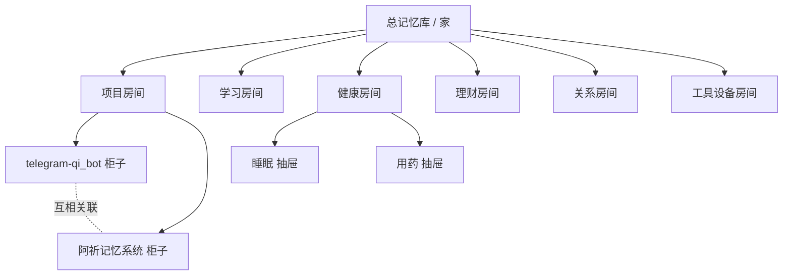
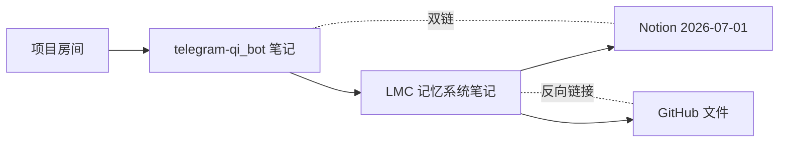
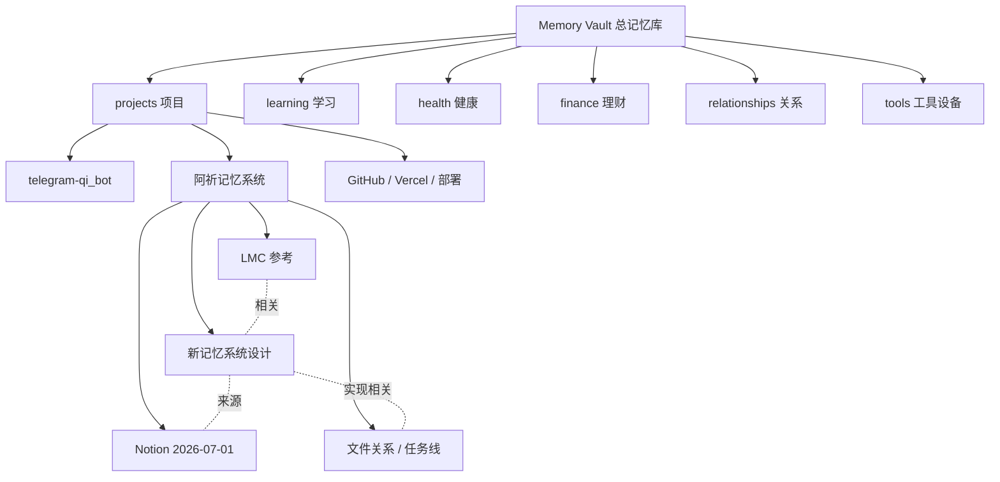
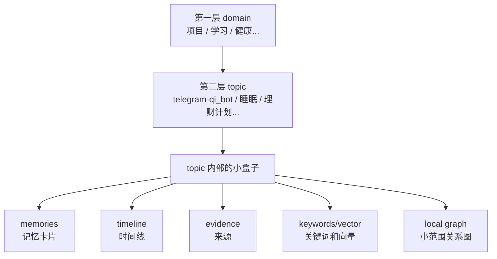
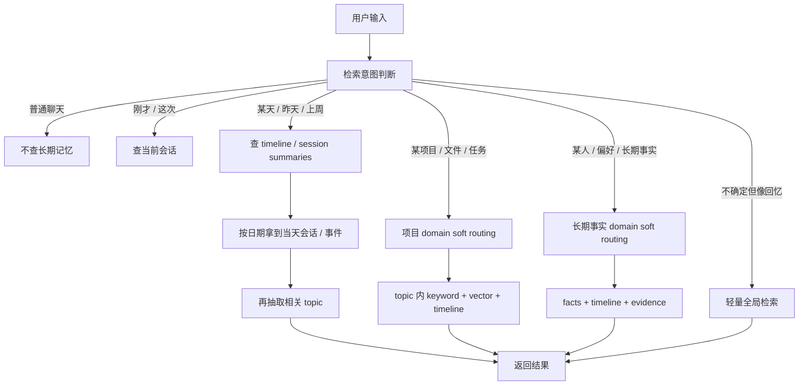
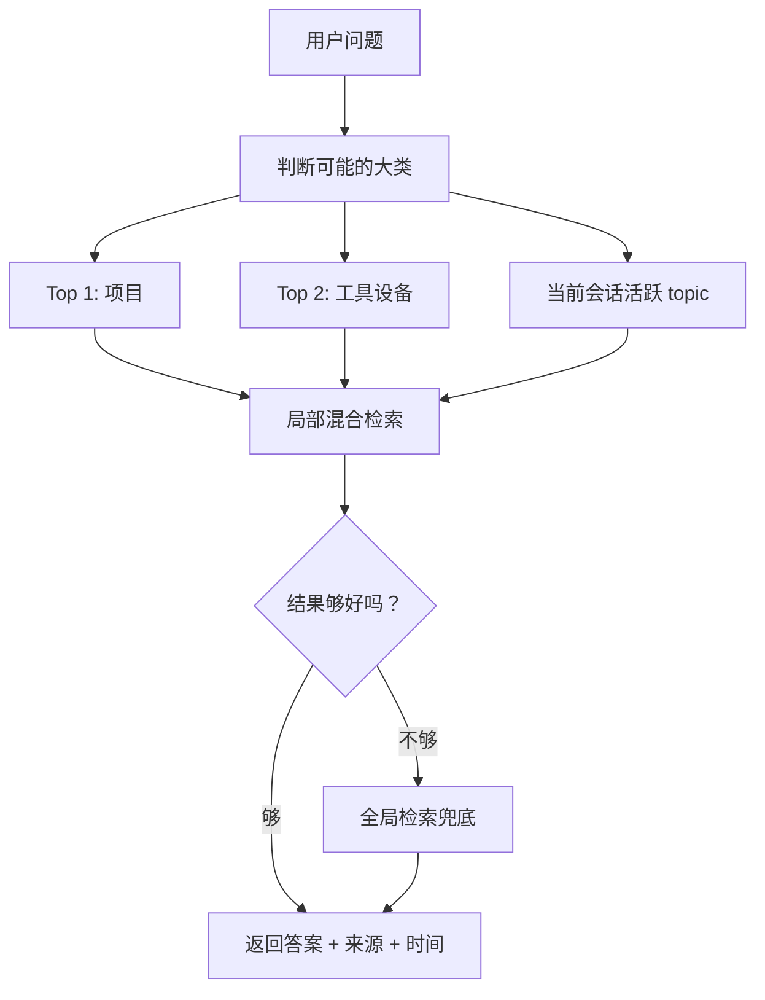
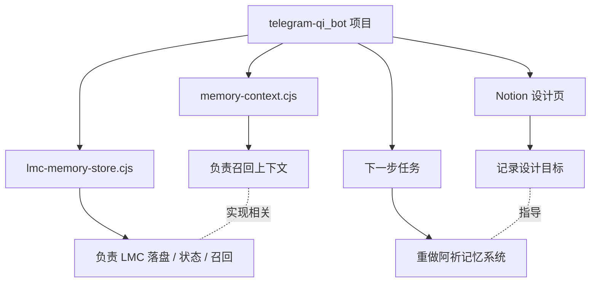
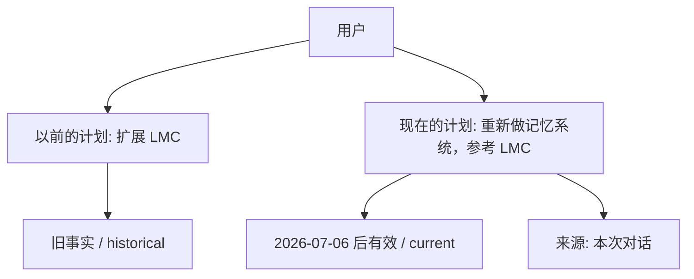

# 阿祈记忆系统初稿

> 记录时间：2026-07-06  
> 状态：初稿，后续继续细化  
> 背景：新系统不打算直接扩展现有 LMC，但会参考 LMC 的分层、时间线、来源证据和召回方式。

## 1. 当前设计方向

我们希望做的不是一个单纯的聊天摘要工具，而是一个长期可维护、可检索、可解释的记忆系统。

核心方向：

```text
Obsidian 式人类视图
+ 第一层 domain 软分类路由
+ 第二层 topic / scope 组织
+ topic 内部混合检索
+ 时间线与来源证据
+ 小范围关系图
+ 全局兜底检索
```

第一层分类不是硬墙，而是检索入口。系统应该优先去最可能相关的 domain / topic 查找，如果找不到，要能扩大范围，最后全局检索。

## 2. 直观图版

这一部分先用生活里的例子解释整体结构，方便之后继续讨论时对齐直觉。

### 2.1 家 / 房间 / 柜子

可以把整个记忆库想成一间屋子：



对应关系：

```text
总记忆库 = 家
第一层 domain = 房间
第二层 topic = 柜子 / 抽屉 / Obsidian 页面
每条 memory = 抽屉里的卡片
vector / keyword = 抽屉里的智能搜索器
timeline = 时间账本
evidence = 来源小票
local graph = 柜子里物品之间的连线
全局检索 = 找不到时翻整间屋子
```

### 2.2 Obsidian 式人类视图

Obsidian 更像给人看的笔记墙：有页面、标签、双链、反向链接和时间线。



Obsidian 适合：

```text
这个东西在哪里？
它跟哪些笔记有关？
怎么手动整理、删除、改分类？
```

它是给人看的地图，不承担全部机器检索。

### 2.3 第一层分区 + 第二层 topic 图

第一层像树，用来快速进入房间；第二层开始更像图，用来表达 topic 之间的关系。



每个 topic 里面再放具体结构：

```text
阿祈记忆系统 topic
├─ memories          具体记忆
├─ timeline          时间线
├─ evidence          来源证据
├─ tags              关键词
├─ links             关联 topic
├─ project_graph     项目/文件关系，偏 Cognee
└─ fact_graph        长期事实变化，偏 Zep/Graphiti
```

### 2.4 topic 内部的小盒子



### 2.5 检索流程图

不是每次都按同一条路径检索，而是先判断用户输入的检索意图。



### 2.6 软路由图

第一层分类是导航，不是牢笼。系统可以优先查最可能的 1-2 个 domain / topic，结果不够时再全局兜底。



### 2.7 项目记忆 vs 长期事实记忆

项目类记忆更像 Cognee：关心文件、任务、模块、修改、依赖。



长期事实记忆更像 Zep / Graphiti：关心事实什么时候有效、什么时候被新事实替代。



## 3. 第一层 domain

第一层建议保持 6-7 个大类，用来做软路由：

```text
self            稳定偏好、表达习惯、边界、长期目标
projects        项目、代码、仓库、任务、文件关系
learning        学习计划、知识体系、阅读记录
health          身体、睡眠、药物、情绪状态
finance         预算、账单、投资、长期财务目标
relationships   人、关系、称呼、互动历史
tools           设备、账号、软件、工作流、远程控制
```

如果不确定放哪里，可以先进入 `inbox` / `unclassified`，后续通过 UI 手动改分类或删除。

## 4. 第二层 topic

第二层不是死树，而是 topic / scope 图。

例子：

```text
projects
  telegram-qi_bot
  阿祈记忆系统
  LMC 参考
  Notion 2026-07-01
  GitHub 文件关系

tools
  Codex 远程控制
  Clash / 代理
  Android 手机控制
```

不同 topic 之间可以互相连接：

```text
阿祈记忆系统 <-> LMC 参考
阿祈记忆系统 <-> Notion 2026-07-01
telegram-qi_bot <-> GitHub 文件关系
Codex 远程控制 <-> Clash / 代理
```

因此：

```text
第一层像树，用于快速进入房间。
第二层开始更像图，用于表达 topic 之间的关系。
```

## 5. 检索原则

不是每次都触发记忆检索，也不是每次都走同一条路径。需要先判断用户输入的检索意图。

### 5.1 检索触发

可能触发记忆检索的表达：

```text
之前、以前、上次、那天、昨天、某某日
我说过、你记得吗、我们聊过、后来计划
那个项目、那个文件、当时、现在还对吗
最近怎么样、下一步是什么、之前定了什么
```

但不能只靠关键词。比如：

```text
那个远程控制后来咋样了
阿祈记忆系统下一步呢
```

这类也明显是在问历史上下文，需要触发检索。

### 5.2 检索策略类型

```text
time_first       按日期 / 时间线优先检索
domain_first     按第一层类别软路由检索
topic_first      按当前或命名 topic 检索
session_first    只查当前会话 / 当前任务
global_light     轻量全局检索兜底
none             不查长期记忆
```

### 5.3 示例

```text
“7月1日我们说过什么？”
-> time_first
-> 查 2026-07-01 的 session summaries / timeline
-> 再按当天内容扩展相关 topic

“7月1日那个记忆系统我们定了什么？”
-> time_first + topic filter
-> 先锁日期，再筛选阿祈记忆系统 topic

“记忆系统下一步是什么？”
-> topic_first / domain_first
-> projects -> 阿祈记忆系统 -> current tasks / timeline

“我最近睡眠怎么样？”
-> domain_first + recent time window
-> health -> 睡眠 -> 最近时间线

“刚才你改了什么？”
-> session_first
-> 当前会话 / 当前任务记录，不需要全局检索
```

### 5.4 软路由流程

```text
用户输入
-> 判断是否需要记忆检索
-> 判断检索意图
-> 选择 1-2 个优先 domain / topic
-> topic 内 keyword + vector + timeline + entity 检索
-> 沿 topic_links 扩展 1-2 跳
-> 检查 evidence / timeline / status
-> 找不到或置信度不够时全局检索
-> 回答时说明来源和时间，必要时说明“不确定”
```

关键原则：

```text
第一层分类是导航，不是牢笼。
```

## 6. 保存原则

模型不应该凭感觉随便保存。保存前要判断：

```text
以后是否会用到？
是不是稳定事实？
是不是用户明确表达的偏好 / 决定？
有没有时间限制？
属于哪个生活 / 项目区域？
有没有旧记忆需要更新或覆盖？
```

### 6.1 应该保存

```text
用户明确说“记住”“以后按照这个”
长期偏好：喜欢 / 讨厌 / 习惯 / 边界
项目事实：仓库、文件作用、设计决定、下一步计划
关系事实：重要人物、称呼、互动背景
长期状态：学习、健康、理财、创作目标
反复出现的模式：多次提到的困扰、偏好、计划
当前任务进展：今天改了什么、卡在哪里、下一步是什么
```

### 6.2 不太需要保存

```text
临时闲聊
一次性问题
未来很少用到的操作细节
没有上下文的情绪碎片
模型自己的临时推测
没有证据支撑的猜测
```

如果不确定，不走复杂的 MemoryCandidate 池。第一版可以自动保存到 `inbox`，后续通过 UI 删除、归档、改 domain、改 topic、改关键词。

## 7. 记忆生命周期

不只分长期 / 短期，建议分五层：

```text
working_memory
当前对话窗口里的内容，不单独入库。

session_memory
这次会话的摘要，例如“今天在讨论记忆系统结构”。可以被压缩。

short_term_memory
短期任务状态，例如“远程控制问题还没恢复”“下一步要看 telegram-qi_bot 的 LMC 结构”。需要 expires_at 或 status。

long_term_memory
长期事实，例如“用户想重新做阿祈记忆系统，不想继续扩展 LMC”“用户偏好中文沟通”“用户不喜欢擅自 clone 或改系统设置”。

timeline_event
发生过的重要事件，例如“2026-07-06 讨论了记忆系统架构，决定采用 domain soft routing + topic graph”。
```

## 8. 参考 Cognee / Zep / Graphiti 的方式

### 8.1 Obsidian：人类视图

用于：

```text
domain / topic 页面
双链 / 反向链接
标签
时间线
人工整理、删除、改分类
```

它是给人看的地图，不承担全部机器检索。

### 8.2 Cognee：项目资料脑

适合项目类记忆：

```text
项目有哪些文件？
哪些文件互相调用？
某个文件是干什么的？
这次修改动了什么？
某个任务影响哪些模块？
```

项目 topic 内部可以有：

```text
project_nodes
- repo
- file
- function
- module
- task
- issue
- notion_page

project_edges
- imports
- modifies
- depends_on
- belongs_to
- explains
- blocks
- references
```

### 8.3 Zep / Graphiti：时间事实脑

适合长期变化的事实：

```text
这个事实现在还对吗？
旧事实有没有被新事实替代？
用户最近的状态是什么？
这件事发生在什么时候？
```

长期事实 topic 内部可以有：

```text
entities
- user
- person
- project
- file
- habit
- preference
- goal

facts
- subject
- relation
- object
- valid_from
- valid_to
- confidence
- evidence_id
- status
```

## 9. 初版数据结构草案

第一版不要做成一个巨大复杂图谱。先做小而可调试的结构。

### 9.1 核心表 / 文件

```text
domains
第一层分类。

topics
第二层 topic / scope，像 Obsidian 页面。

topic_links
topic 之间的双链 / 关系。

memories
具体记忆卡片。

evidence
记忆来源，例如对话片段、Notion 页面、GitHub 文件、操作日志。

timeline_events
按时间组织的重要事件。
```

### 9.2 memory 示例

```json
{
  "id": "mem_20260706_aqi_memory_direction",
  "content": "用户想重新做阿祈记忆系统，不想继续扩展现有 LMC，但希望参考 LMC 的记忆方式。",
  "domain": "projects",
  "topic": "aqi-memory-system",
  "lifetime": "long_term",
  "status": "current",
  "event_time": "2026-07-06",
  "keywords": ["阿祈记忆系统", "LMC", "重新设计", "长期记忆", "检索"],
  "source": "conversation",
  "confidence": 0.92
}
```

### 9.3 topic 内部结构

```text
topic
  memories          具体记忆
  timeline          时间线
  evidence          来源证据
  tags              关键词
  links             关联 topic
  vector_index      局部向量索引
  local_graph       小范围关系图
```

## 10. 第一版 MVP

第一版目标：能跑、能解释、能改，不追求一次做到最复杂。

建议 MVP：

```text
1. 固定 6-7 个 domains
2. 自动创建 / 选择 topic
3. 自动保存 memory，带 domain、topic、lifetime、status、time、keywords、source
4. 支持 timeline / session summary
5. 检索时先做 intent 判断
6. 支持 domain/topic soft routing
7. topic 内 keyword + vector 混合检索
8. 找不到时全局兜底
9. UI 支持删除、归档、改 domain、改 topic、改关键词
```

暂时不做：

```text
复杂 MemoryCandidate 审核池
完整多跳全局知识图谱
复杂衰减算法
过重的自动本体构建
大型可视化图谱 UI
```

## 11. 目前已确定的设计决策

```text
1. 不直接扩展现有 LMC，倾向重新做一个新的记忆核心。
2. 参考 LMC 的分层、状态、时间线、来源证据和召回思路。
3. 第一层 domain 用于软路由，不是硬分类。
4. 第二层 topic 允许互相链接，不能做成死树。
5. topic 内部使用 keyword + vector + timeline + local graph 混合检索。
6. 如果路由失败或证据不足，必须全局检索兜底。
7. 不是每次用户输入都触发长期记忆检索，需要先判断检索意图。
8. 时间类问题优先走 timeline / session summary，不必先 domain 路由。
9. 项目类记忆参考 Cognee：文件、任务、修改、依赖、来源。
10. 长期事实类记忆参考 Zep / Graphiti：实体、事实、有效时间、失效时间、证据。
11. 人类视图可以参考 Obsidian：domain、topic、双链、标签、时间线。
12. 不引入复杂 MemoryCandidate 作为必要流程，第一版自动保存 + 后续可删除 / 改分类。
```

## 12. 后续待细化问题

```text
1. domain 是否最终固定为 7 个，还是允许用户自定义？
2. topic 自动创建时如何避免重复 topic？
3. 记忆写入时如何判断 update / supersede / new memory？
4. timeline_event 和 memory 的边界如何划分？
5. project_nodes / project_edges 是否放在第一版，还是第二阶段？
6. entities / facts 是否放在第一版，还是第二阶段？
7. local vector index 用现有 memory-vector 方案还是重做？
8. UI 第一版只做删除 / 改分类，还是同时做时间线视图？
9. 如何在回答里展示“来源”和“最近事实”？
10. 如何避免模型把推测写成事实？
```
