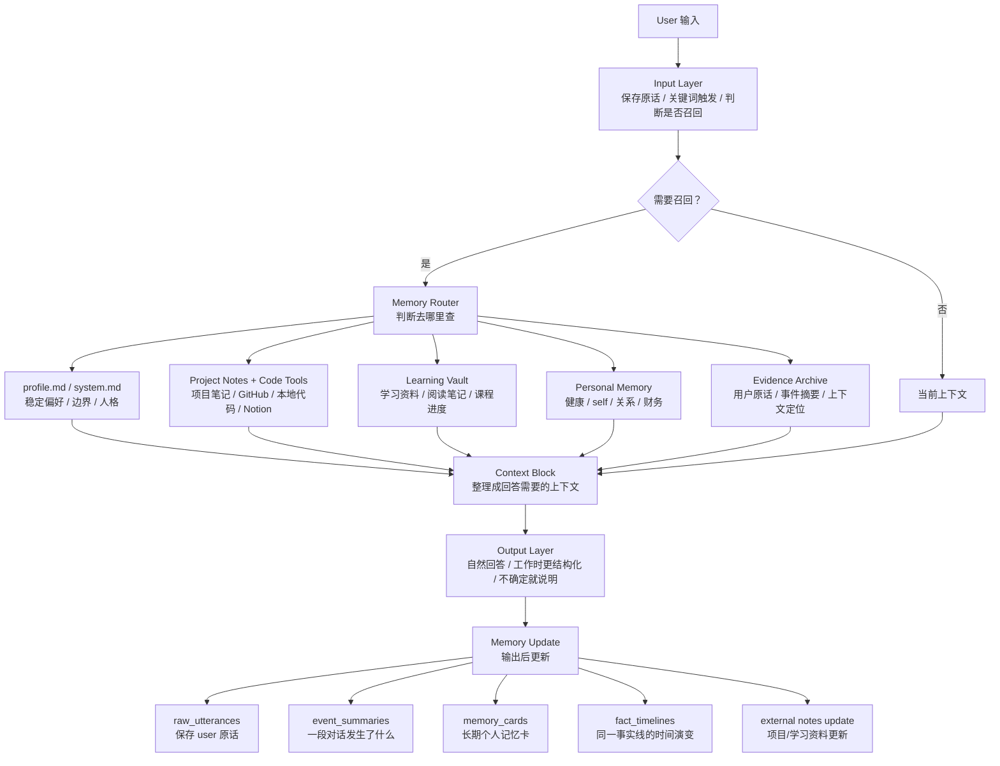

# 阿祈记忆系统计划稿

> 记录时间：2026-07-06 / 2026-07-07  
> 状态：当前版初稿，后续继续细化  
> 背景：不直接扩展现有 LMC。新系统保留 LMC-5 的 raw events、curated memory、事实演变、召回 trace 等启发，但整体方案收束为更轻量的“记忆路由器 + 外部笔记 + 个人记忆 + 证据档案”。

## 1. 当前结论

我们不做一个包办所有事情的超级记忆库。当前方向是：

```text
Aqi Memory Router
负责判断去哪查、怎么组装上下文。

profile.md / system.md
保存稳定偏好、边界、人格和输出方式。

external notes
保存项目、代码、学习资料等变化快或体量大的内容。

personal memory
保存健康、self、关系、财务等长期个人状态。

evidence archive
保存用户原话、事件摘要、上下文定位信息。
```

一句话：

```text
稳定偏好写进 profile；变化快的放外部笔记；个人长期状态用轻量记忆卡；可变事实用时间线；原话只做证据。
```

## 2. 总体结构图



## 3. 各部分职责

### 3.1 profile.md / system.md

用于保存稳定、长期、会影响模型行为的内容。

适合写入：

```text
用户偏好中文沟通。
用户不希望我擅自 clone 仓库或改系统设置。
日常聊天要自然，不必每次展示来源。
工作/项目讨论可以更结构化。
健康、财务、关系类回答要以用户输入为主，不做过度推断。
```

这些内容不进入复杂记忆数据库，用 Markdown 规则直接控制模型行为更稳。

### 3.2 external notes

变化快、资料量大、需要工具实时确认的内容放外部。

项目/代码类：

```text
project-notes/<project>/overview.md
project-notes/<project>/decisions.md
project-notes/<project>/tasks.md
project-notes/<project>/file-map.md
project-notes/<project>/log.md
```

学习类：

```text
learning-vault/<topic>/notes.md
learning-vault/<topic>/reading.md
learning-vault/<topic>/progress.md
```

原则：

```text
项目细节不塞进通用长期记忆。
代码事实以仓库/工具实时查看为准。
学习资料原文放外部资料库。
通用记忆只记入口、大方向和长期偏好。
```

### 3.3 personal memory

用于健康、self、关系、财务等长期个人状态。这里使用轻量 `memory_card`。

适合写入：

```text
用户明确表达的长期偏好。
用户确认的健康、财务、关系状态。
用户与模型的互动边界和沟通方式。
持续性的计划、目标、习惯、趋势。
```

不适合写入：

```text
模型自行诊断。
模型过度心理推断。
一次性闲聊。
未经用户确认的敏感判断。
```

### 3.4 evidence archive

保存用户原话和上下文定位，不等于当前事实。

用于回答：

```text
我是不是说过 xxx？
我原话怎么说的？
哪天提到过？
你记得我之前说过的 xxx 吗？
```

原则：

```text
原话是证据，不自动变成 current fact。
重复原话可以聚类，但不破坏代表性原文。
需要上下文时，通过 conversation_id + message_index 回查前后内容。
```

## 4. 输入、处理、输出、更新

整个系统按四段理解：

```text
Input
用户原始输入、保存原话、关键词触发召回。

Processing
参考当前上下文和可能召回的记忆/笔记/证据，组装 Context Block。

Output
自然回答。日常不刻意展示来源；工作场景可以更明确；不确定就说明。

Memory Update
回复后更新：保存原话、生成 event summary、必要时写 memory_card 或 fact_timeline。
```

## 5. 召回触发策略

第一版采用关键词触发，不让模型每轮自行判断是否召回。

```text
无关键词触发 -> 不查长期记忆
有关键词触发 -> 分析语义，决定查哪里
```

触发词列表后续再确认。目前只保留方向：

```text
之前、以前、上次、那天、昨天、最近
你记得、我说过、我们聊过、原话
下一步、计划、待办、继续、还没做
那个项目、那个系统、这个文件、那个人
现在还是、有没有变、为什么改
```

触发后不做复杂硬过滤，而是先生成简单检索路线：

```text
utterance_search  查用户原话
active_topic      查最近活跃主题
time/event        查某段事件摘要或日期附近内容
topic             查某个明确主题
domain            查大类范围
global_light      轻量全局兜底
```

第一版避免过度复杂：

```text
不要每轮全局深搜。
不要复杂多跳图检索。
不要把 domain/topic 判断当硬门。
结果不确定时说不确定。
```

## 6. Context Block

参考 Zep 的 context block 思路：召回后不要把零散结果直接塞给模型，而是整理成回答需要的小包。

Aqi Context Block 可以包含：

```text
current facts       当前有效事实
active plans        当前计划/待办
recent events       最近相关事件摘要
external notes      项目/学习外部笔记摘录
raw evidence        必要时的用户原话证据
warnings            旧事实/原话证据/推测不能当 current fact
```

日常聊天时 Context Block 应该尽量轻；工作问题可以更完整。

## 7. memory_card 字段

当前建议的个人长期记忆卡字段：

```json
{
  "id": "mem_xxx",
  "title": "召回采用关键词触发",
  "content": "用户决定第一版采用关键词触发召回，而不是每轮让模型自行判断。",
  "domain": "self | health | finance | relationships | learning | tools | projects_ref",
  "topic": "阿祈记忆系统",
  "type": "fact | decision | plan | event | preference | summary | lesson",
  "status": "current | active | needs_review | archived",
  "tags": ["召回", "关键词触发", "检索"],
  "source_refs": ["utterance_20260707_001"],
  "source_strength": "explicit_user_decision",
  "confidence": 0.95,
  "fact_key": "aqi_memory.retrieval.trigger_policy",
  "active_fact": true,
  "created_at": "2026-07-07T...",
  "updated_at": "2026-07-07T...",
  "hit_count": 0,
  "last_hit_at": null,
  "content_hash": "sha256..."
}
```

暂时不加入完整 E 轴。只保留：

```text
source_strength
表示来源强度：用户明确说、用户明确决定、多次模式、模型推测、外部文档等。

confidence
表示模型整理这条记忆的信心。
```

暂时不加入：

```text
risk_level
urgency
response_tendency
valence
arousal
tension
growth_delta
```

这些更适合后续阶段，或者直接由 profile.md 控制输出人格。

## 8. fact_timeline：事实演变

可变事实不用 `supersedes / superseded_by` 互相指来指去，改用时间线。

原则：

```text
时间线按发生顺序保存：最早 -> 最新。
只有 current 需要明确标注。
历史信息只按时间呈现，不需要 old/discarded/considered 一堆状态。
current_event_id 指向当前有效版本。
```

示例：

```json
{
  "fact_key": "retrieval.trigger_policy",
  "topic": "阿祈记忆系统",
  "current_event_id": "evt_keyword_trigger",
  "events": [
    {
      "id": "evt_model_judge",
      "time": "2026-07-07T10:00:00",
      "content": "讨论过让模型自行判断是否召回。",
      "source_refs": ["utterance_001"]
    },
    {
      "id": "evt_keyword_trigger",
      "time": "2026-07-07T11:00:00",
      "content": "决定第一版采用关键词触发召回。",
      "source_refs": ["utterance_002"]
    }
  ]
}
```

检索/回答：

```text
问“现在是什么？” -> 读 current_event_id 指向的事件。
问“怎么变成这样的？” -> 按时间正序讲 timeline。
问“最近变化？” -> 倒序看最近事件。
```

## 9. event_summary

event summary 不是长期事实，而是把一段原始对话/一组事件压成“发生了什么”。

作用：

```text
帮助回答“那段对话大概发生了什么”。
帮助快速定位上下文。
帮助后续生成 memory_card。
不替代用户原话。
不替代 current fact。
```

示例：

```json
{
  "id": "event_summary_20260707_memory_design",
  "time_range": {
    "start": "2026-07-07T10:00:00",
    "end": "2026-07-07T12:00:00"
  },
  "topic": "阿祈记忆系统",
  "summary": "讨论了召回触发、项目记忆外部化、时间线式事实更新、原话证据去重，以及 event summary 的作用。",
  "key_decisions": [
    "第一版召回采用关键词触发。",
    "可变事实用时间线，current_event_id 标当前有效版本。",
    "项目/代码类记忆外部化。"
  ],
  "source_event_ids": ["evt_001", "evt_002", "evt_003"]
}
```

生成时机：

```text
会话结束时。
topic 明显切换时。
同一段对话积累到一定长度时。
```

## 10. raw_utterances 与 utterance_clusters

raw utterance 保存用户原话，至少包含：

```json
{
  "id": "utt_xxx",
  "speaker": "user",
  "text": "原话内容",
  "time": "2026-07-07T...",
  "conversation_id": "conv_20260707",
  "message_index": 123,
  "topic_hint": "阿祈记忆系统",
  "event_summary_id": "event_summary_20260707_memory_design"
}
```

重复/相似原话不要直接丢掉，先聚类：

```json
{
  "id": "ucl_lmc_not_expand",
  "theme": "用户不想继续扩展 LMC，想重新做记忆系统",
  "canonical_utterance_id": "utt_20260706_001",
  "canonical_text": "我不太想扩展lmc了，我想重新做一下，但是需要参考lmc的记忆方式。",
  "occurrences": [
    {
      "utterance_id": "utt_20260706_001",
      "time": "2026-07-06T...",
      "conversation_id": "conv_20260706",
      "message_index": 143
    },
    {
      "utterance_id": "utt_20260706_009",
      "time": "2026-07-06T...",
      "conversation_id": "conv_20260706",
      "message_index": 168
    }
  ],
  "count": 2,
  "first_seen": "2026-07-06T...",
  "last_seen": "2026-07-06T..."
}
```

原则：

```text
展示时用 canonical_text。
保留重复出现的时间点和位置。
必要时通过 conversation_id + message_index 查前后上下文。
被 memory_card 引用的原话长期保留。
明显重复且无证据价值的原文可后期归档，但不丢时间索引。
```

## 11. 外部化策略

### 11.1 项目/代码

项目类记忆特殊，变化快，单独外部化。

```text
通用记忆只保存项目入口和长期协作偏好。
项目细节写 project notes。
代码事实以仓库实时查看为准。
需要项目记忆时，Router 调用工具读取外部文件和代码。
```

### 11.2 学习

学习资料也适合外部库。

```text
通用记忆保存学习目标、阶段、偏好、进度入口。
学习资料原文、阅读笔记、课程内容放 learning vault / Notion / Obsidian。
```

### 11.3 健康 / 财务 / 关系 / self

这些放 personal memory，但要谨慎：

```text
健康、财务以用户输入为主，不做模型诊断。
用户和其他人的关系以用户明确写入为主，模型推测只作低置信观察。
用户和模型的关系可以记录互动偏好、边界和踩雷点。
self 是长期稳定偏好的核心来源，但非常稳定的内容应进入 profile.md。
```

## 12. 第一版 MVP

第一版只做这些：

```text
1. profile.md / system.md 作为稳定偏好入口。
2. Project Notes / Learning Vault 外部化。
3. Personal memory cards。
4. fact_timeline：按时间正序 + current_event_id。
5. raw_utterances：保存 user 原话和上下文定位。
6. utterance_clusters：重复原话聚类。
7. event_summary：一段对话发生了什么。
8. 关键词触发召回。
9. Aqi Context Block：把召回结果整理给模型。
10. 基础 UI/管理：删除、归档、改 topic/domain、标记错误。
```

暂时不做：

```text
完整 E 轴。
复杂 MemoryCandidate 审核池。
全局大知识图谱。
复杂多跳推理。
自动人格分析。
每轮模型判断是否召回。
自动重写大型 snapshot。
项目文件关系长期死记。
```

## 13. 已确认设计决策

```text
1. 新系统不直接扩展现有 LMC。
2. 第一版采用关键词触发召回。
3. 项目/代码类记忆外部化，通过工具读取 project notes 和代码。
4. 学习资料外部化，通用记忆只记目标和进度入口。
5. Profile Memory 写进 system.md/profile.md，不单独做数据库。
6. Personal Memory 使用轻量 memory_card。
7. 可变事实用 fact_timeline，不用 supersedes/superseded_by 主导。
8. 时间线底层按时间正序保存，current_event_id 标当前版本。
9. 历史信息用时间线表达，不需要给历史贴太多状态。
10. 原话证据不等于 current fact。
11. 重复原话用 utterance_clusters 聚类，保留时间和上下文定位。
12. Event summary 用于定位一段对话，不替代长期事实。
13. 日常回答自然，不必每次刻意展示来源；工作场景可以更明确。
14. 健康、财务、关系记忆以用户输入为主，模型推测必须有边界。
```

## 14. 后续待确认

```text
1. 固定 domain 的最终名字。
2. 关键词触发列表的最终版本。
3. memory_card 字段是否继续精简。
4. source_strength 的枚举值。
5. confidence 是否保留，以及如何避免伪精确。
6. fact_key 如何生成，中文/英文命名规则。
7. event_summary 生成粒度：按会话、按 topic 切换，还是按消息数量。
8. raw_utterances 的保留期限和归档规则。
9. utterance_clusters 的相似度阈值。
10. Project Notes 和 Learning Vault 的实际目录结构。
11. Aqi Context Block 的具体格式。
12. UI 第一版具体做哪些管理能力。
```
